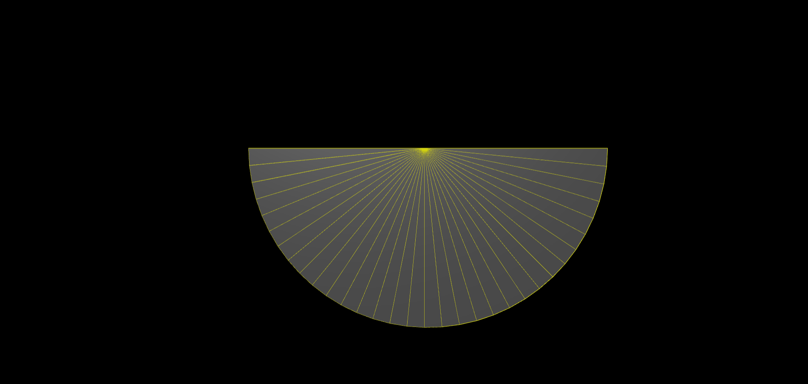
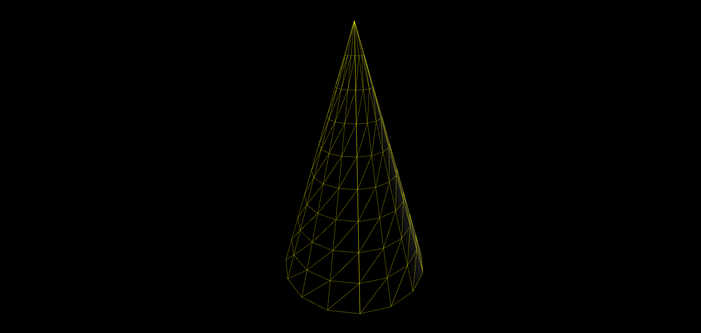

three.js 
========

### 입문강의 🚀

> 출처: https://www.youtube.com/watch?v=ZGACJosABBw&list=PLe6NQuuFBu7HqxY10b6gNu6iisT2-rZv-


#### 2022-04-09 ~

| 자동으로 돌아가는 기능 (BoxGeometry, requestAnimationFrame) |
| :---------------------------------------------------------: |
|                    |


| 선으로 나누는 기능(LineSegments), 커서로 돌리는 기능(OrbitControls) |
| :----------------------------------------------------------: |
|                     |

|  원판 기능 (CircleGeometry) [4개의 인자]  |
| :---------------------------------------: |
|  |
|         1, 32, Math.PI,  Math.PI          |

```
첫번째 인자: 원의 크기 (default: 1)
두번째 인자: 원판을 구성하는 분할 개수 (세그먼트 수) (default: 8 (값이 클 수록 원의 형태를 나타냄 (n각형))
세번째 인자: 시작 각도 (default: 0)
네번째 인자: 연장 각도 (default: 2파이)
```

|   원뿔 기능 (CornGeometry) [7개의 인자]   |
| :---------------------------------------: |
|  |
|    0.5, 1.6, 16, 9, true, 0, Math.PI*2    |

```
첫번째 인자: 밑면에 해당되는 원의 반지름 크기 (default: 1)
두번째 인자: 원뿔의 높이 (default: 1)
세번째 인자: 원뿔의 둘레 방향에 대한 분할개수 (default: 8) [세로]
네번째 인자: 원뿔의 높이 방향에 대한 분할 개수 (default: 1) [가로]
다섯번째 인자: 원뿔 밑면을 열어 놓을 것인지에 대한 여부 (defalut: false)
여섯번째 & 일곱번째 인자: 원뿔의 시작 각 & 연장각 (defalut: 0 & 2파이)
```

|  원뿔 기능 (CylinderGeometry) [8개의 인자]  |
| :-----------------------------------------: |
|    |
| 0.9, 0.9, 1.6, 32, 12, true, 0, Math.PI * 2 |

```
1 & 2: 윗 면 & 밑 면 반지름 크기 (default: 1)
3: 원통의 높이 (default: 1)
4: 원통의 둘레 방향에 대한 분할개수 (default: 8)
5: 원통의 높이 방향에 대한 분할 개수: (default: 1)
6: 원통의 윗면과 밑면을 열어 놓을 것인지에 대한 여부 (defalut: false)
7 & 8: 원뿔의 시작 각과 연장 각 (defalut: 0 & 2파이)
```

|   구 기능 (SphereGeometry) [7개의 인자]   |
| :---------------------------------------: |
|  |
|                    0.8                    |

```
1: 구의 반지름 크기 (default: 1)
2: 수평 방향에 대한 분할 수 (default: 32)
3: 수직 방향에 대한 분할 수 (default: 16)[가로]
4 & 5: 수평 방향에 대한 구의 시작 각과 연장 각 (default: 0 & 2파이)
6 & 7: 수직 방향에 대한 구의 시작 각과 연장 각 (0, 파이)
```

